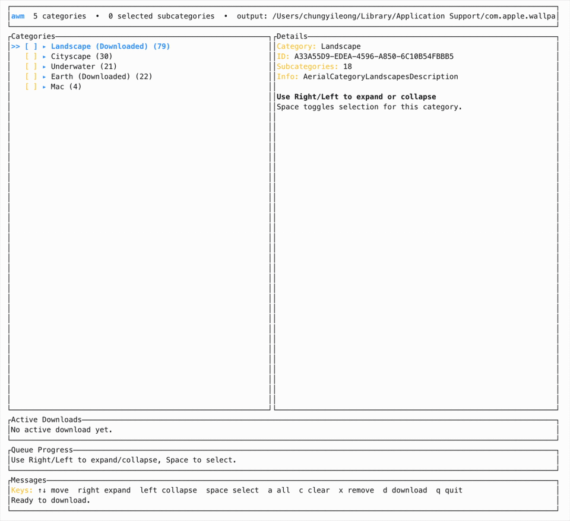

# Apple Wallpaper Manager

Terminal app for browsing and downloading Apple wallpapers on macOS, with a TUI, live progress bars, and category/subcategory navigation.



## Features

- Browse wallpaper categories and subcategories in a collapsible TUI
- Select nothing by default, then expand categories and choose subcategories to download
- Download multiple assets concurrently with a default of 4 workers
- Show live per-file progress for each active download
- Show an overall queue progress bar
- Save downloads to the same wallpaper storage location the original app uses

## Install

Preferred:

```bash
brew tap chungyileong/tap
brew install awm
```

This installs the same unsigned Apple Silicon binary published in GitHub Releases. If Gatekeeper flags it on first run, clear the quarantine flag before launching it.

Fallback manual install from the release tarball:

```bash
curl -LO https://github.com/chungyileong/apple-wallpaper-manager/releases/download/vX.Y.Z/awm-macos-arm64.tar.gz
tar -xzf awm-macos-arm64.tar.gz
chmod +x awm
sudo mv awm /usr/local/bin/
xattr -d com.apple.quarantine /usr/local/bin/awm
```

Then run:

```bash
awm
```

### Build from source

Requires a Rust toolchain.

```bash
cargo build --release
./target/release/awm
```

## Usage

You can also choose a destination folder:

```bash
awm --output ~/Library/Application\ Support/com.apple.wallpaper/aerials/videos
```

You can change the worker count with:

```bash
awm --threads 6
```

## Controls

- `↑` / `↓` move through the category tree
- `→` expand a category
- `←` collapse a category
- `space` toggle the current category or subcategory
- `a` select all subcategories
- `c` clear selection
- `x` remove the currently selected item from disk
- `d` or `Enter` start downloading
- `q` quit

## Notes

- Downloads are written through temporary `.part` files and renamed into place when complete.
- The default download destination matches the original app's wallpaper storage folder.
- The default download worker count is 4.
- Existing files are skipped when they already match the remote size.
- Downloaded assets are marked in the tree view with `[x]`.
- If the server reports a content length, each active download row shows byte-based completion. If it does not, the app still tracks the transfer and shows the byte count.
